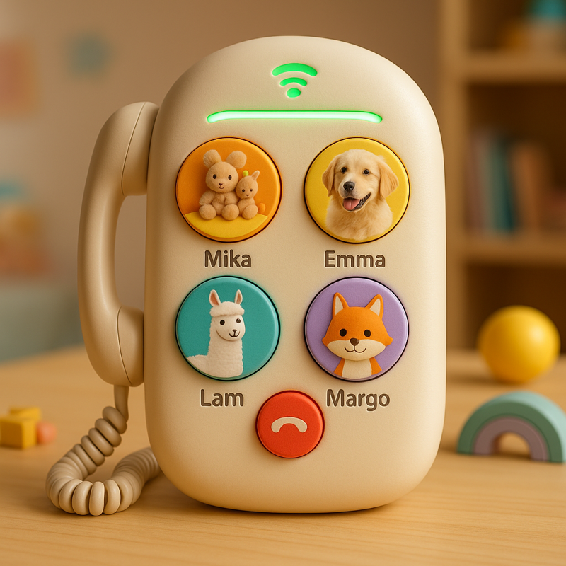
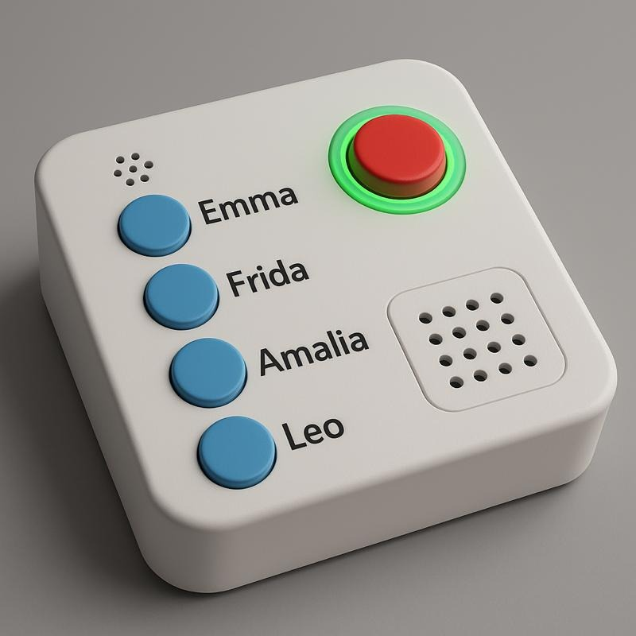

# EmmaPhone2 - Kid-Friendly WebRTC Client

A web-based WebRTC client designed for kids, featuring large speed dial buttons and simple interface. Built using LiveKit for real-time communication and designed for eventual deployment on Raspberry Pi Zero 2.

## Design Concepts

### Hardware Vision - Design Mockup 1

*Retro-inspired design with 4 speed dial buttons featuring family photos and a classic phone aesthetic*

### Hardware Vision - Design Mockup 2

*Modern minimalist design with dedicated speed dial buttons, call/hangup controls, and integrated speaker*

These mockups represent the vision for the final EmmaPhone2 hardware device - a kid-friendly calling device that combines the simplicity of traditional phones with modern WebRTC technology.

## Features

- **Kid-Friendly Interface**: Large, colorful buttons with clear labels
- **Speed Dial**: 4 programmable speed dial buttons for quick calling
- **WebRTC Audio**: Browser-based real-time audio communication
- **LiveKit Integration**: Professional WebRTC infrastructure with SIP bridge support
- **Responsive Design**: Works on desktop and mobile devices
- **Traditional Phone Support**: SIP bridge allows calling regular phone numbers

## Quick Start

1. Install dependencies:
   ```bash
   npm install
   ```

2. Start LiveKit services:
   ```bash
   docker compose -f docker-compose-livekit.yml up -d
   ```

3. Start the development server:
   ```bash
   npm run dev
   ```

4. Open your browser to `https://localhost:3443` (HTTPS required for microphone access)

5. Click "Connect to LiveKit" and test with speed dial buttons

## Architecture

### Current Implementation
- **Web Client**: LiveKit Web SDK for WebRTC communication
- **Backend**: Node.js/Express server with JWT token generation
- **Infrastructure**: LiveKit server with SIP bridge for traditional phone integration
- **Containerized**: Docker Compose setup for easy deployment

### LiveKit Configuration

The system uses three main services:
- **LiveKit Server**: Core WebRTC server (port 7880)
- **LiveKit SIP**: SIP-to-WebRTC bridge (port 5060)
- **Redis**: Session management and coordination

Configuration files:
- `livekit-config.yaml` - Main LiveKit server settings
- `livekit-sip-config.yaml` - SIP bridge configuration
- `docker-compose-livekit.yml` - Docker services

## Browser Requirements

- Chrome, Firefox, Safari, or Edge with WebRTC support
- HTTPS required for microphone access
- Modern browser with WebRTC capabilities

## Development Roadmap

- [x] Phase 1: Web-based LiveKit client ✓
- [ ] Phase 2: Raspberry Pi hardware integration
- [ ] Phase 3: Enhanced configuration web interface
- [ ] Phase 4: Production deployment optimization
- [ ] Phase 5: Hardware button integration

## Testing

### Web Client Testing
1. Open multiple browser windows/tabs to `https://localhost:3443`
2. Connect each client to LiveKit
3. Use speed dial buttons to test inter-client calling

### Future SIP Integration
The LiveKit SIP bridge is configured to allow traditional SIP phones to join the same rooms as web clients, enabling hybrid communication.

## License

MIT